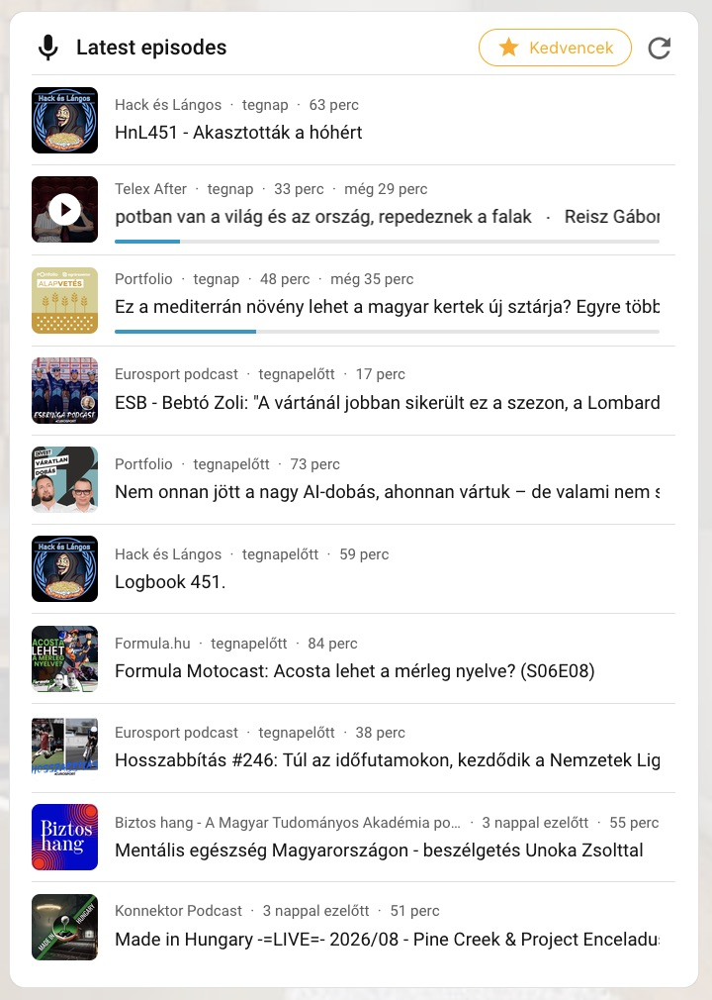
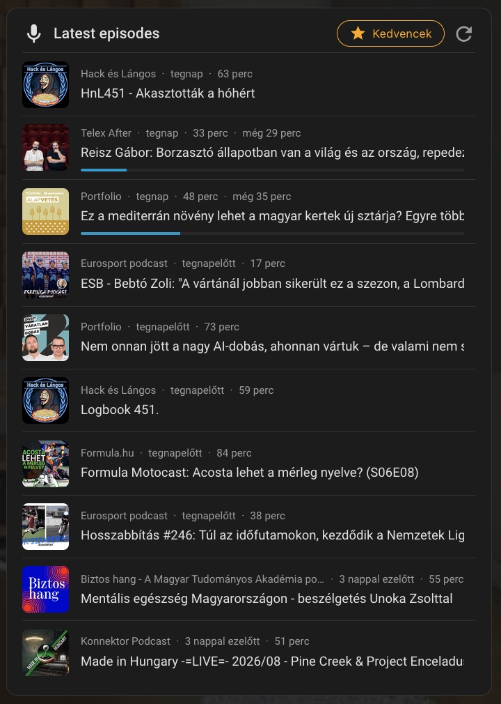

# Music Assistant Podcasts (Home Assistant custom component)


Aggregates the latest episodes of every podcast feed in your Music Assistant
library into a single Home Assistant sensor, with a custom dashboard card.

## Features
- "Latest episodes" list (default: 50) merged from all subscribed podcast
  feeds, sorted by publish date
- Play state per episode: unplayed / in progress (with position) / finished
- Cover image is the play trigger (hover overlay / tap) with a short
  "starting playback" toast on the row
- Episode title click opens an expandable, scrollable description
  (full-width panel, bold title on top, one open at a time) — descriptions
  are fetched on demand from Music Assistant, never stored in the sensor
- Live progress bar and remaining time — position comes from the MA player
  entity in real time; play states sync through a lightweight coordinator
  (fast while playing, slow otherwise) plus on-demand polling of the last
  started episode
- Podcast name links to the podcast page in the Music Assistant web UI
- Seamless marquee on overflowing episode titles (hover only)
- Favourite shows
- Auto-registered, versioned Lovelace card with an interactive editor and
  YAML mode; follows the Home Assistant language
- Authenticated image/progress/description proxies — the Music Assistant
  token never reaches the browser

## Preview
<div> </div>

## Setup
### HACS
- HACS → top-right menu → Custom repositories
- Repository: `droM4X/ha-music-assistant-podcasts`, Type: `Integration`
- Restart Home Assistant after adding

### Manually
- Clone/download the repo
- Copy the `custom_components` folder into your HA config directory
- Restart Home Assistant

## Configuration
- Add the integration "Music Assistant Podcasts"
- **Server URL**: your Music Assistant server (usually prefilled)
- **Auth**: a long-lived access token (MA: Settings → Profile), or your
  username + password — in that case the integration creates the token for
  you
- Add the card from the picker: **Music Assistant Podcasts Card**
  (interactive editor, or minimal YAML below)
- The show list refreshes on start and hourly by default; the refresh button
  triggers it manually

### Minimal manual config
```
type: custom:music-assistant-podcasts-card
player: media_player.my_player   # playback target (overrides the integration default)
max_items: 20                    # rows shown
```

### Integration options
- **Episodes per feed**: how many newest episodes are fetched per podcast
- **List size**: maximum rows in the merged list
- **Update interval**: automatic refresh cadence (minutes)
- **Default player**: used when the card/service gets no player
- **Force refresh**: always ask providers for fresh data (slower)
